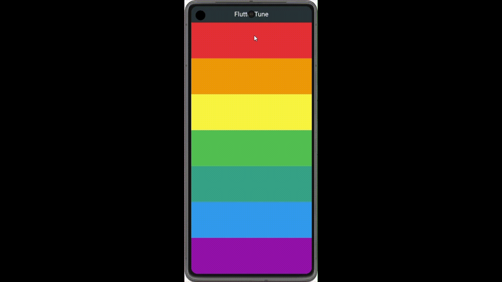

# 🎵 Tunes Player App

The **Tunes Player App** is a Flutter-based application that simulates a piano keyboard. It provides a simple, interactive, and user-friendly interface to explore music by playing notes directly on a virtual keyboard.

## 🚀 Features

- **Interactive Keyboard**: Tap piano keys to produce corresponding sounds with realistic audio effects.
- **User-Friendly Design**: Intuitive layout suitable for users of all ages and experience levels.
- **Customization Options**: Control sound features such as volume and octave ranges.
- **Cross-Platform**: Built with Flutter, ensuring compatibility with Android, iOS, web, and desktop platforms.

## 🎥 Demo

Check out the app in action below:



## 🛠️ Installation

1. **Clone the repository**:
   ```bash
   git clone https://github.com/NadaAlaa1/tunes_player_app.git
   cd tunes_player_app

2. **Install dependencies** Ensure Flutter is installed on your system. Then, run the following command:
   ```bash
   flutter pub get

3. **Run the App**
   ```bash
   flutter run
